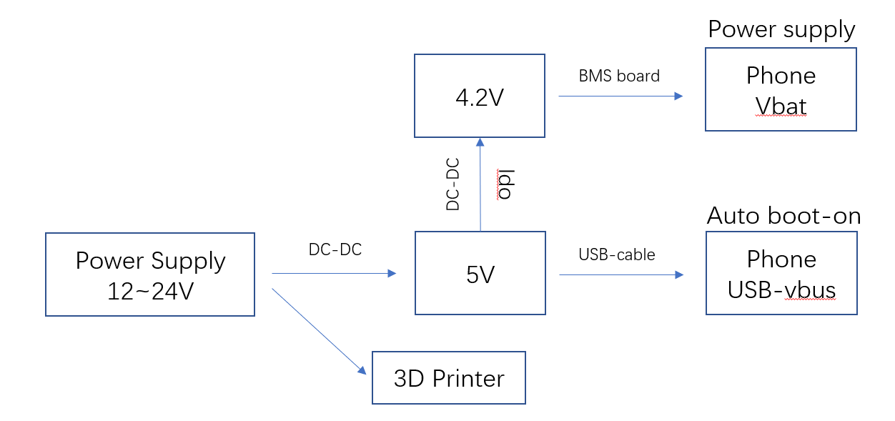
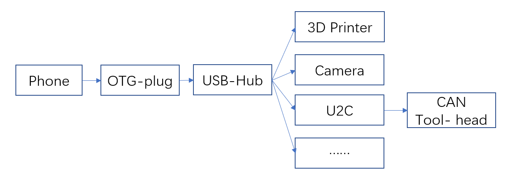
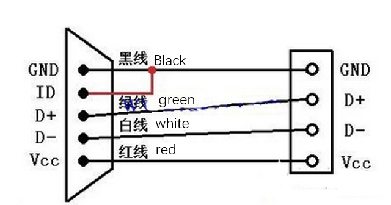

# 概览

这里提供了一些常用机型的直供电改装方案，以供参考。
除了使用PCB进行改装外，你也可以根据一个基本的指导原理来自行改装你的手机。

- 拆解你的电池取出电池保护板，取下电芯，将4.2V或者5V的直流电输入保护板中，替换掉手机电芯
- 利用otg插头插入手机的尾插，开启手机的USB主机模式。
- 将5V直流电通入手机的尾插USB中，手机会从关机状态下自动开机

- 手机通过USB线缆与3D打印机及外设通信

# 一些细节
- 💡3D打印机的电气系统可靠接地🔌是确保其稳定可靠运行的重要前提。
- 确保手机的电源与打印机主板共地，最好通过独立的开关电源供电给手机。使用主板的风扇接口为手机供电可能会导致问题。
- 红米2 需要识别到正版的电池充电芯片，才能够正常工作，否则开机后无法正确的识别到USB设备。
- 使用高通625 cpu的机型，将4.7V直接输入到手机主板的Vbat触点中，即可正常工作，可以无需使用电池保护板。Vbat和Vusb不能相通！必须保证`Vbat < Vusb`。
- OTG功能是通过识别micro-usb中的`id管脚`或typeC中的`cc管脚`来实现的，如果手机识别不到，请`id管脚`或者`cc管脚`的连接方式。没有正确进入otg模式会表现为，在`lsusb`命令下，没有任何输出反馈。
- USB信号线请尽可能短，将D+,D-缠绕，并使用带屏蔽网，屏蔽环的线材，否则容易出现连接不稳定断线的情况。

