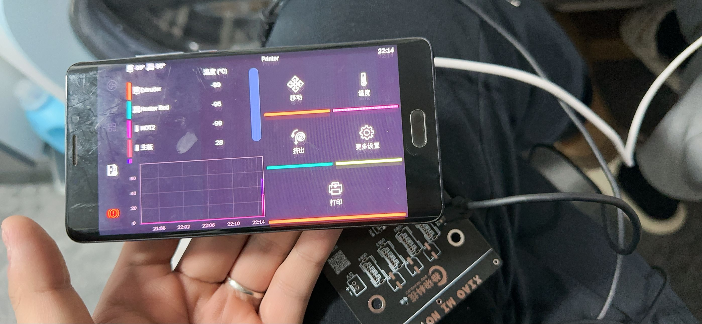
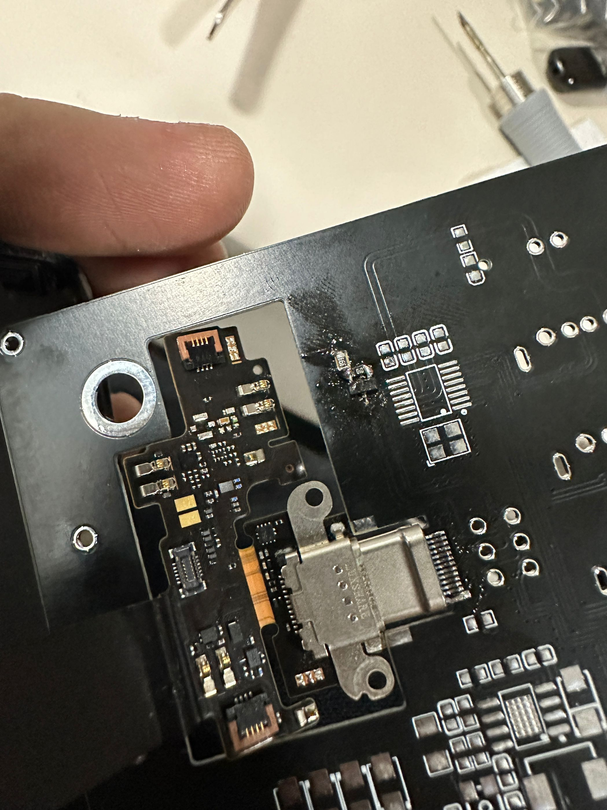

# Overview
[中文文档](./README_CN.md)

- Includes DC-DC function, stepping down 12~24V DC to the working voltage of the phone
- Non-destructive modification, elegantly replacing the phone's battery
- Equipped with USB one-to-four function, can simultaneously connect various peripherals

# Instructions

- Take out the SIM card tray after turning off the phone.
- Heat the phone with a 100-degree heating plate for 5 minutes, then slowly remove the back cover.
- Gently detach the battery.
- Disassemble the battery, take out the battery BMS board, and solder the encryption chip on the board
- Remove all screws from the bottom tail plug, heat it, then remove the tail plug sub-board and insert it into the Type-C male connector on the power supply PCB.

[LCEDA-shiqi](https://oshwhub.com/sqkj/red-rice-4-direct-power-supply-hub).
