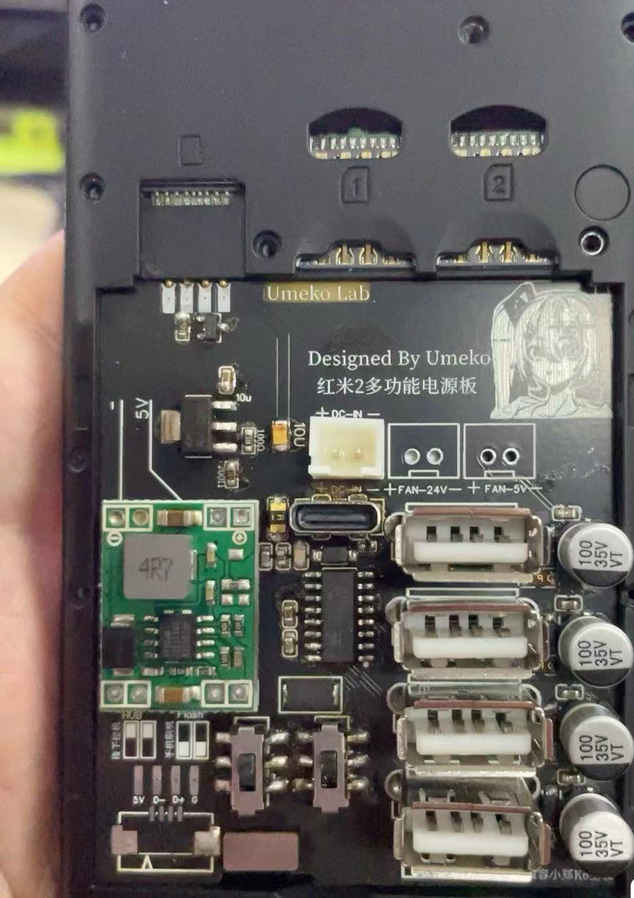
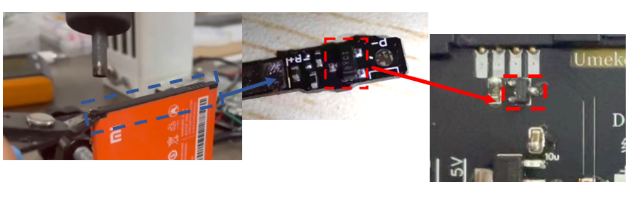
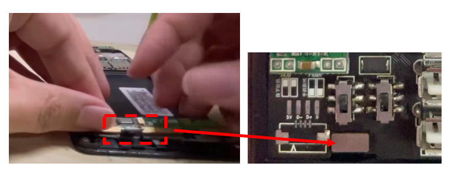

# Overview
[中文文档](./README_CN.md)
- Includes DC-DC function, stepping down 12~24V DC to the working voltage of the phone
- Non-destructive modification, elegantly replacing the phone's battery
- Includes a battery encryption chip function, allowing the phone to recognize it as a normal battery
- Uses the original phone's BTB cable, directly connecting to the phone's motherboard for stable operation
- Equipped with USB one-to-four function, can simultaneously connect various peripherals
- Can directly flash the phone through the typc-C interface

# Instructions

- Disassemble the battery, take out the battery BMS board, and solder the encryption chip on the board

- Disassemble the phone, plug the cable from the tail plug into the board.

[Operation video](https://www.bilibili.com/video/BV1nw411175i/).

You can buy a modified redmi-2 from:

