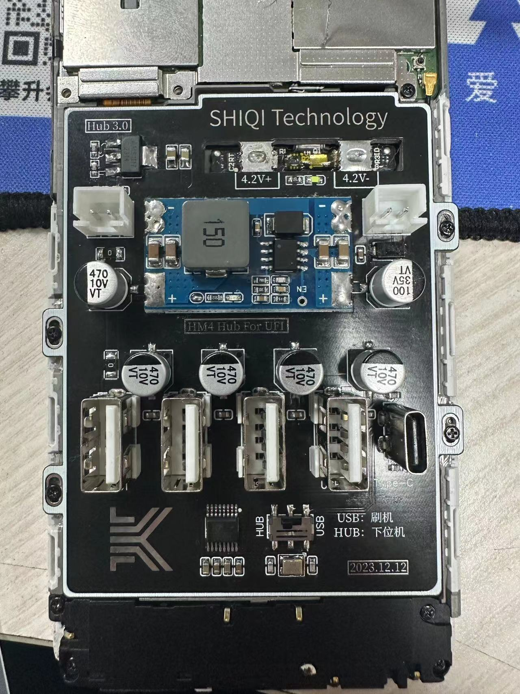
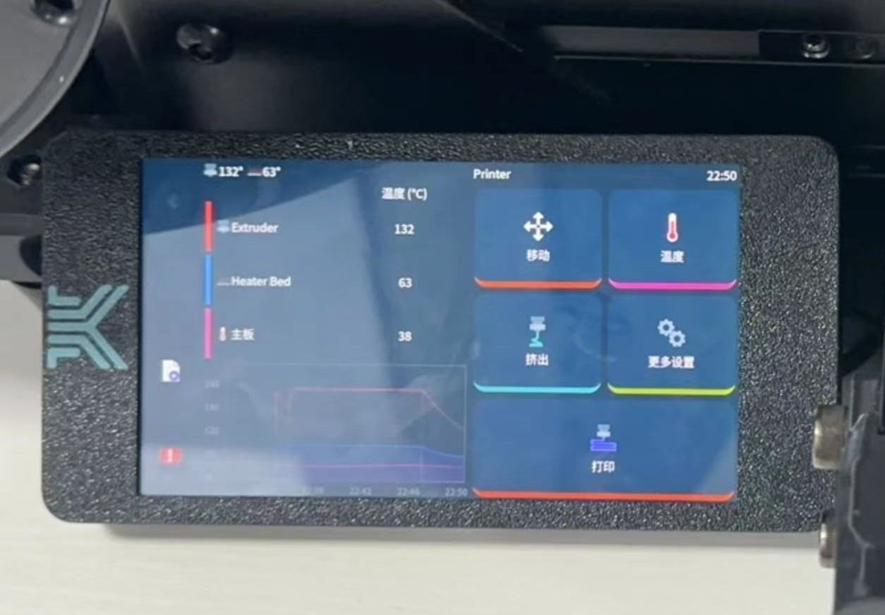

# Overview
[中文文档](./README_CN.md)
- Includes DC-DC function, stepping down 12~24V DC to the working voltage of the phone
- Non-destructive modification, elegantly replacing the phone's battery
- Includes a battery encryption chip function, allowing the phone to recognize it as a normal battery
- Uses the original phone's BTB cable, directly connecting to the phone's motherboard for stable operation
- Equipped with USB one-to-four function, can simultaneously connect various peripherals
- Can directly flash the phone through the typc-C interface

# Instructions

- Remove the two screws at the bottom of the phone.
- Take out the SIM card tray after turning off the phone.
- Heat the phone with a 100-degree heating plate for 5 minutes, then slowly remove the back cover.
- Gently detach the battery.
- Disassemble the battery, take out the battery BMS board, and solder the encryption chip on the board
- Disassemble the phone, plug the cable from the tail plug into the board.

[LCEDA-shiqi](https://oshwhub.com/sqkj/red-rice-4-direct-power-supply-hub).
