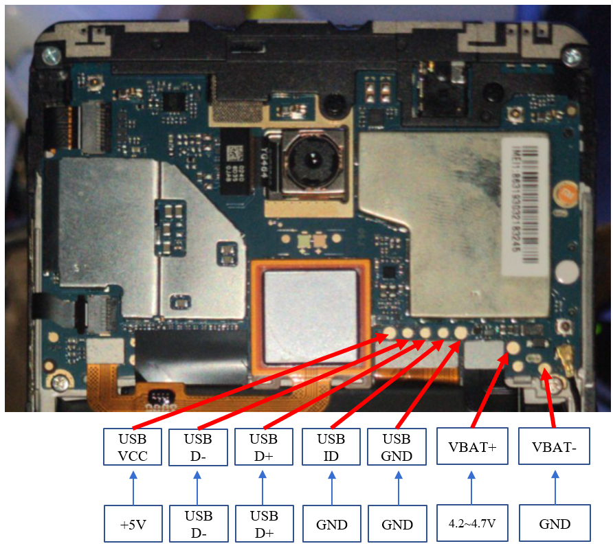
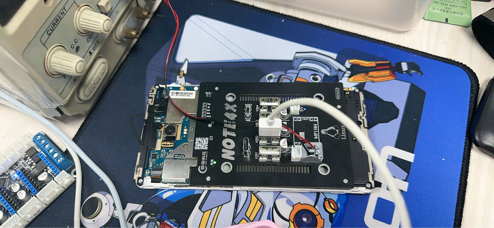

# 改装思路
[English](./readme.md)

- 首先移除电池与尾插排线。
- 红米Note4X主板上设计了USB与供电的测试触点，直接飞线即可完成改装。根据下图进行飞线即可。

## PCB方案
[视频](https://www.bilibili.com/video/BV1oH4y177H2/)
- 使用弹簧端子连接主板触点，实现无损改装
- 包括 DC-DC 功能，将 12~24V 直流电降压到手机的工作电压
- 包含电池加密芯片功能，使手机能够将其识别为正常电池
- 使用原始手机的 BTB 电缆，直接连接到手机主板以保持稳定运行
- 配备 USB 一分四功能，可以同时连接各种外围设备
- 可以通过 Type-C 接口直接刷写手机

# 使用说明

- 在关闭手机后取出 SIM 卡托盘。
- 使用 100 度加热板加热手机 5 分钟，然后慢慢取下背盖 (可以利用打印机热床来实现)。
- 轻轻拆下电池。
- 断开手机的原始尾插 BTB，并使用螺丝将 PCB 固定在手机上。

[LCEDA-shiqi](https://oshwhub.com/sqkj).
