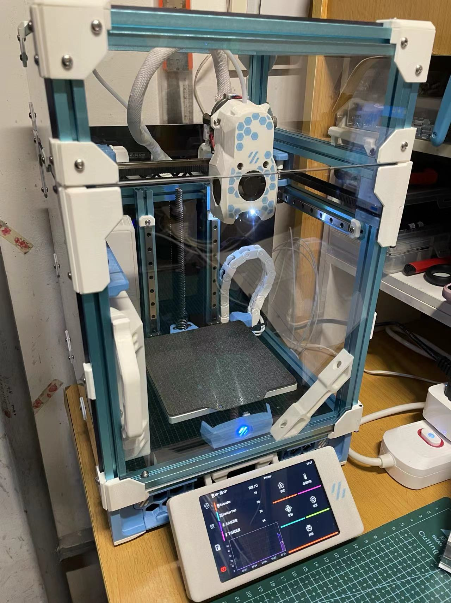
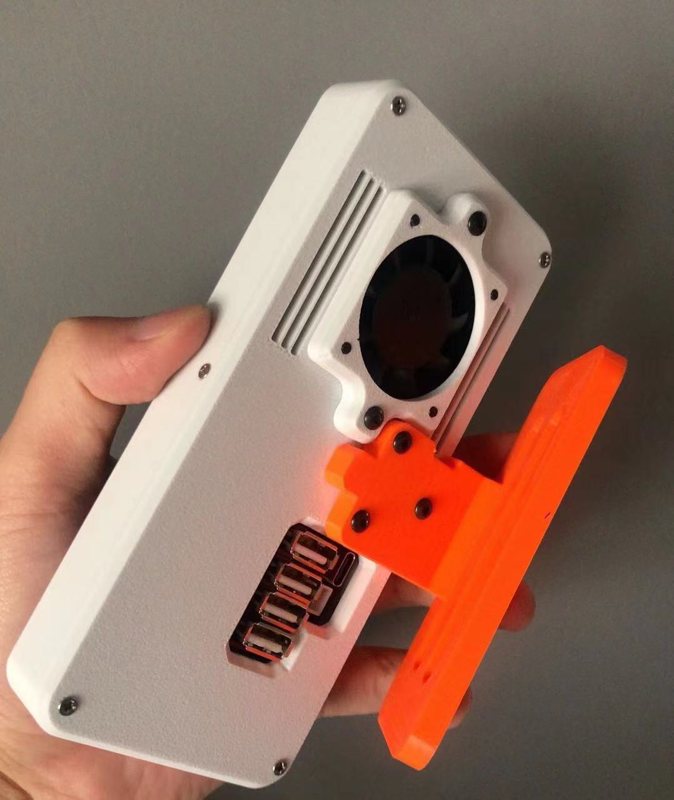

# KlipperPhonesLinux
Building an Klipper Machine Host for a 3D Printer Based on Native Linux System Adapted for Mobile Phones

让你的旧手机变为高性能Linux系统的Klipper上位机

## 支持的机型
- Xiaomi Redmi 2 (wt88047)
- Xiaomi Redmi 5 Plus (xiaomi-vince)
- Xiaomi Mi 5X (xiaomi-tissot)
- Xiaomi Mi A1 (xiaomi-tissot)
- Xiaomi Mi A2 Lite (xiaomi-daisy)
- Xiaomi Redmi 6 Pro (xiaomi-daisy)
- Xiaomi Redmi 4 Prime (xiaomi-markw)
- Xiaomi Redmi 5 Plus (xiaomi-vince)
- Xiaomi Redmi Note 4 (xiaomi-mido)
- Xiaomi Redmi S2 (xiaomi-ysl)
- Xiaomi Redmi Y2 (xiaomi-ysl)
- Xiaomi Redmi 4x (xiaomi-santoni)
- Xiaomi Note 2 (xiaomi-scopito)

## 刷机方法：
- [Xiaomi Redmi 2]()
- [高通625机型](https://github.com/umeiko/lk2nd/releases/tag/625_Flasher)
- [Xiaomi Note2]()
- [Xiaomi Redmi 4x]()

## 刷机后如何快速开始
- 连接终端
  - 使用网络(推荐) 
    - 使用KlipperScreen连接到你的局域网
    - 网络浏览器输入`你手机的ip地址:8888`即可，例如`192.168.31.124:8888`
  - 使用usb串口
    - usb线缆连接到你的电脑，你的电脑将识别到串口设备。
    - 使用`PuTTY`或其它终端软件进入终端控制台。

- 利用otg插头连接到你的3D打印机主板
   - 在命令行中使用`lsusb`命令，确保系统识别到了你的3D打印机主板。
     - 常见的主板会显示为`Qingheng`, `OpenMoko xxx`等。
     - 如果没有识别到的话，请检查你的线缆连接情况。
   - 为你的3D打印机主板安装Klipper固件。
     - 安装交叉编译器

           sudo apt update
           sudo apt install avrdude gcc-avr binutils-avr avr-libc stm32flash libnewlib-arm-none-eabi gcc-arm-none-eabi binutils-arm-none-eabi pkg-config
      
      - 参考[Klipper文档](https://www.klipper3d.org/zh/Installation.html) 为你的主板编译安装Klipper固件
  
- 设置3D打印机的配置文件
    - 向你的打印机主板销售方索取，或在[Klipper仓库](https://github.com/Klipper3d/klipper/tree/master/config)中寻找你主板型号的配置文件。
    - 打开`Fluidd`界面，你可以用网页浏览器访问`你手机的ip地址`打开。
    - 在右侧的`配置`选项卡中，将你的主板配置文件重命名为`printer.cfg`并覆盖原始的文件。
    - 在`printer.cfg`的末尾填入 `[include fluidd.cfg]`

- 此时你就完成了简单的配置工作，享受吧！

## 将你的手机改装为直流供电（PCB）

- Xiaomi Redmi 2 (wt88047)
- Xiaomi Redmi Note 4 (xiaomi-mido)
- Xiaomi Redmi 4 Prime(xiaomi-markw)
- Xiaomi Redmi 4x (xiaomi-santoni)

## 常见问题及解决方案：
- 启用和设置CAN
- 我想要旋转屏幕
- 归零时发生错误`timer too close`
- `lsusb`没有任何反应
